<div align="center">



</div>


<div align="center">


[](https://git.io/typing-svg)

</div>

```python
class Atharv:
    def __init__(self):
        self.location = "Pune, India 🇮🇳"
        self.role = "AI Engineer | Data Scientist"
        self.education = "BE in AI & ML (Graduating 2026)"
        self.achievements = ["Kaggle 2x Expert 🏆", "4 Internships Completed"]
        self.motto = "Helping Machines transform the world, Epoch by Epoch"
        
    def current_focus(self):
        return {
            "🔥 Hot Topics": ["RAG Systems", "LLM Fine-tuning", "AI Agents"],
            "💼 Work": ["GenAI for Fintech", "Computer Vision", "NLP"],
            "📚 Learning": ["MLOps", "Production AI", "Advanced LLMs"],
            "🎯 Goal": "Ship AI products that actually solve real problems"
        }
```

<div align="center">

## 📫 Let's Connect

[](mailto:atharv.sabde19@gmail.com)
[](https://www.linkedin.com/in/atharv-sabde-4aa272222/)
[](https://twitter.com/atharv_sabde)
[](https://www.kaggle.com/atharvsabde)
[](https://atharvsabdeportfoliov1.vercel.app/)

</div>

---

## 💻 Tech Arsenal

**AI & ML Frameworks**  


**LLMs & RAG**  


**Data & Visualization**  


**Cloud & Tools**  


---

## 💼 Experience Highlights

**🚀 DevDynamics** (AIML Developer Intern)  
Built AI evaluation pipelines with FutureAGI → improved code review quality and developer productivity

**💰 The Nirmata** (AI Engineer Intern)  
Developed GenAI models for fintech → OCR, document processing, deployed on AWS, time series forecasting

**🎨 Pixel Stitch** (AI Research Intern)  
Created text-to-image models and LoRA implementations → trained with Kohya-ss and ComfyUI workflows

**📊 CodSoft** (Data Science Intern)  
Built prediction models for movies, sales, and survival analysis → hands-on ML deployment

---

## 📌 Pinned Projects

### 🔒 [RedactAI](https://github.com/AtharvSabde/RedactAI)
Intelligent document redaction with automated PII detection MCP Server  
`Python`  `Ollama` `MCP`

### 🌾 [Cropverse](https://github.com/AtharvSabde/Cropverse)
Agricultural intelligence platform → crop prediction and yield forecasting  
`Python` `ML` `AgriTech` `IoT`

### 🧠 [Cognitive Stress Detection](https://github.com/AtharvSabde/Cognitive-Stress-Detection-System)
Voice-based cognitive stress detection using audio features and ML → early impairment indicators  
`Python` `ML` `Gemini AI` `Audio Processing`

### 🤖 [X Automation AI](https://github.com/AtharvSabde/X_automation)
AI system that mimics any Twitter user's writing style → scrapes tweets, analyzes patterns, generates posts  
`Python` `Agno` `NLP` `Web Scraping`

**[→ View all repositories](https://github.com/AtharvSabde?tab=repositories)**

---

---

<div align="center">

### 💭 Random Dev Quote


---

**✨ "Helping Machines transform the world, Epoch by Epoch"**


</div>


